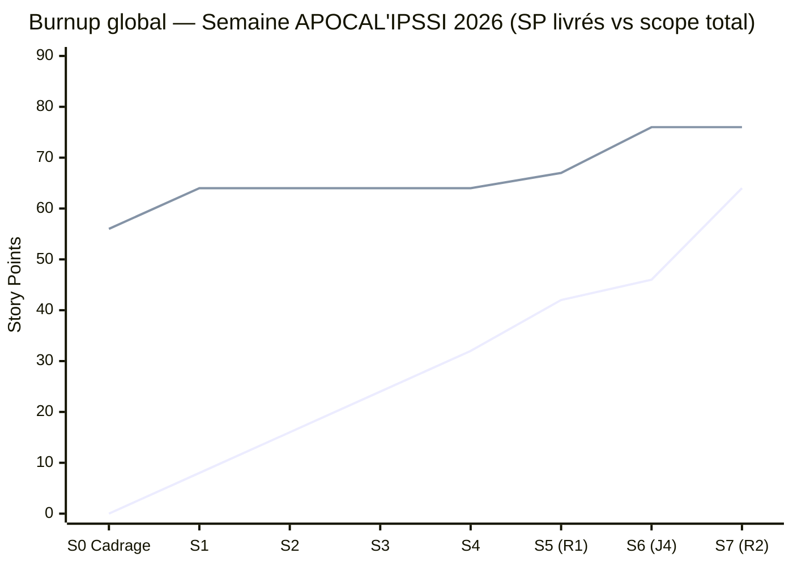

# Burndown + Burnup — Perturbation J4 (Passage à l'échelle)

**Équipe 17** · Abdelhadi MOUMOU, Jason DAHMOUN, Julie SAINT MARTIN, Kephren BIBANG, Mathis PENAGOS, Stive GAMY, Karam DHIFI
**Date** : Jeudi 02/07/2026 · **Perturbation** : J4 — Livraison / Crise (déverrouillée 10h00)
**Version** : v1.0 · **Dépôt** : `/docs/pilotage/`

---

## 1. Contexte de la mise à jour

La perturbation J4, révélée à 10h00 ce jeudi, ajoute **3 nouvelles épopées** au scope du produit : Scalabilité, Accessibilité RGAA, Internationalisation (i18n). Contrairement à J1 (qui avait ajouté une cible utilisateur avec 3 stories, +8 SP), J4 ajoute un axe transverse à tout le produit existant — l'impact sur le scope est donc structurellement différent : ce n'est pas juste "+X SP dans un coin du backlog", c'est une charge qui traverse plusieurs fonctionnalités déjà livrées (F1 à F6).

Ce document met à jour les deux graphes de pilotage : le **Burndown Sprint 6** (jeudi matin, en cours) et le **Burnup global** (semaine complète), pour refléter cet impact.

---

## 2. Burndown — Sprint 4 (jeudi matin, 09h00–12h30)

### 2.1 Rappel de lecture

Le burndown trace les heures-personnes restantes au cours du sprint (descendant). Idéal : descente linéaire de la capacité du sprint vers 0. Un écart réel > idéal signale un retard ; réel < idéal signale une avance.

### 2.2 Données

D'après `docs/cadrage/equipe-17-sprint-backlog-v4.0.xlsx` (onglet Sprint 4), le sprint post-perturbation compte **8 tâches techniques réparties sur les 3 axes**, pour un total de **18,5 h estimées** sur une capacité de **28 h-pers** (marge de 12h volontairement conservée pour l'onboarding sur des sujets nouveaux — Redis, RGAA, i18n — et le pair-programming) :

| Axe | User Stories | Tâches | Estim. (h) |
|---|---|---|---|
| 1. Accessibilité (RGAA) | US-25, US-26 | Contrastes + ARIA, navigation clavier, audit CI (axe-core/lighthouse) | 6,5 |
| 2. Internationalisation (i18n) | US-21, US-22 | react-i18next + extraction textes, prompt LLM multilingue | 5 |
| 3. Scalabilité | US-23, US-24 | Cache Redis, séparation conteneurs, fallback LLM cloud | 7 |
| **Total** | 6 US | 8 tâches | **18,5 h** |

| Moment du sprint | Heures restantes (idéal) | Heures restantes (réel) | Δ réel − idéal | Commentaire |
|---|---|---|---|---|
| 09h00, Début sprint | 28 | 28 | 0 | Sprint démarré sur l'objectif initial du planning (US-07 dashboard, US-08 révision, US-19 conseils) |
| 10h00, **Perturbation J4** | 21 | **28 + 18,5 = 46,5** | **+25,5** | ⚡ Réinjection de 18,5h de tâches neuves (3 axes RGAA/i18n/scalabilité) sans réduction du travail déjà planifié — le sprint change d'objectif en cours de route |
| 10h30, Daily post-perturbation | 17,5 | 41 | +23,5 | Repriorisation actée en daily : US-19 (conseils personnalisés) mise en pause, effort redirigé vers les 8 tâches J4 |
| 11h30, Point de vigilance | 10,5 | 27 | +16,5 | Les 8 tâches sont volontairement calibrées « diagnostic + PoC minimal » (ex. cache Redis configuré mais non généralisé, un seul fallback LLM cloud branché) plutôt qu'une remédiation exhaustive — cohérent avec la marge de 12h laissée par l'équipe dès la planification |
| 12h30, Fin sprint / Review | 0 | ~14 | **~+14** | Sprint partiellement soldé : reste-à-faire basculé en dette technique documentée (voir Matrice des risques), reporté sur le Sprint 5 (jeudi PM, avant Release 2) |

### 2.3 Lecture de la courbe

**Réel très supérieur à idéal après 10h00** — signal attendu d'une perturbation qui injecte du scope en cours de sprint, pas un signe de sprint mal maîtrisé. Le point notable ici est que l'équipe avait **déjà anticipé une marge de 12h** dès la planification du Sprint 4 (28h capacité pour 18,5h de tâches J4 seules, avant même de compter l'objectif initial du sprint) — preuve que le dimensionnement de la charge J4 a été fait avec du recul, pas dans l'urgence pure.

**Décision de pilotage** : les 8 tâches J4 sont scoping "diagnostic + PoC minimal" sur chacun des 3 axes plutôt qu'une remédiation complète (ex. Redis configuré en cache mais pas généralisé à tous les endpoints ; un seul provider de fallback LLM branché, pas une architecture multi-provider complète). Ce choix est documenté ici pour être traçable en soutenance.

---

## 3. Burnup — Vue globale semaine (impact cumulé des perturbations)

### 3.1 Rappel de lecture

Le burnup trace les story points **livrés cumulés** (montant) avec une ligne distincte pour le **scope total**, qui peut lui-même augmenter. Contrairement au burndown, il rend visible qu'un sprint peut ne "rien perdre en vélocité" alors que le scope grandit sous ses pieds — c'est exactement le cas de J1, J3, J3-bis et maintenant J4.

### 3.2 Données mises à jour

| Sprint | Fin de sprint | SP livrés (idéal) | SP livrés (réel) | Scope total |
|---|---|---|---|---|
| Sprint 0 (Cadrage) | Lun 13h00 | 0 | 0 | 56 |
| Sprint 1 | Lun 18h00 | 8 | 8 | 64 *(+8 SP, J1 — cible Mme Lefèvre)* |
| Sprint 2 | Mar 12h30 | 16 | 16 | 64 |
| Sprint 3 | Mar 18h00 | 24 | 24 | 64 |
| Sprint 4 | Mer 12h30 | 34 | 32 | 64 |
| Sprint 5 (R1) | Mer 17h45 | 44 | 42 | 67 *(+3 SP, J3-bis — export RGPD/SAR)* |
| **Sprint 6 (en cours)** | **Jeu 12h30** | **54** | **~46*** | **≈ 76** *(+9 SP, J4 — 18,5h estimées / 6 US / 3 axes scalabilité, RGAA, i18n)* |
| Sprint 7 (R2) | Jeu 17h45 | 64 | *à venir* | *à confirmer selon arbitrage MoSCoW post-J4* |

`*` SP réel Sprint 6 estimé à mi-parcours du sprint (le sprint n'est pas encore clos au moment de la rédaction de ce document) — à consolider à 12h30 en Sprint Review.

Conversion heures → SP : sur la base des sprints précédents de l'équipe (ex. Sprint 4 mercredi matin : ~16h estimées ≈ 10 SP cible, ratio ≈ 1 SP / 1,5-1,7h), les 18,5h de tâches J4 (`equipe-17-sprint-backlog-v4.0.xlsx`, onglet Sprint 4) représentent environ **9 SP**, répartis approximativement : RGAA ~4 SP, Scalabilité ~3 SP, i18n ~2 SP.

### 3.3 Impact J4 sur le burnup — détail

| Élément | Valeur | Décision / justification |
|---|---|---|
| Scope avant J4 | 67 SP | État après R1 (MVP livré mercredi 17h45), incluant les correctifs J3 (sécurité LLM) et J3-bis (RGPD) déjà absorbés sans extension de scope |
| Scope après J4 | ≈ 76 SP | +9 SP répartis sur 3 nouvelles épopées : RGAA (~4 SP, US-25/US-26), Scalabilité (~3 SP, US-23/US-24), i18n (~2 SP, US-21/US-22) — 8 tâches au total, 18,5h estimées (`sprint-backlog-v4.0.xlsx`, onglet Sprint 4) |
| Écart cumulé scope / capacité théorique | 76 SP vs 64 SP planifiés initialement (+19%) | Le scope de la semaine a crû de 36% depuis le cadrage initial (56 → 76 SP) sous l'effet cumulé de J1 + J3-bis + J4. C'est un signal à présenter tel quel en soutenance : la vélocité réelle de l'équipe n'a pas baissé, c'est le périmètre qui a été redéfini à chaque perturbation, ce qui est le principe même de l'exercice |
| Risque sur Release 2 (17h45) | Modéré — l'équipe a anticipé une marge de 12h dès la planification du Sprint 4 (28h capacité pour 18,5h de tâches J4) | Décision : traiter le diagnostic + PoC minimal sur les 3 axes en Sprint 4 (fait), réserver le Sprint 5 (jeudi PM) à la stabilisation de l'existant (F1-F6) et à un arbitrage MoSCoW strict sur ce qui passe réellement en Release 2 candidate |

### 3.4 Diagramme (Mermaid)

*Ligne du bas : SP livrés cumulés (réel). Ligne du haut : scope total (augmente à J1, J3-bis, J4).*

### 3.5 Lecture

L'écart entre les deux lignes (livré vs scope) se creuse visiblement à partir du Sprint 6, mais de façon plus contenue que redouté à chaud (+9 SP et non +12) grâce à un cadrage réaliste des 3 axes en "diagnostic + PoC" plutôt qu'en remédiation exhaustive. Si le Sprint 7 ramène l'écart à un niveau proche de celui d'avant J4, cela démontrera une capacité d'absorption de crise correcte pour la soutenance ; si l'écart reste béant à 17h45, ce sera un point à assumer et expliquer dans le post-mortem plutôt qu'à masquer.

---

## 4. Prochaine mise à jour

Ce document doit être complété avec les **SP réels du Sprint 6** dès la Sprint Review de 12h30, puis à nouveau après la Release 2 (17h45) pour clore la ligne Sprint 7 du burnup avant dépôt final.

---

*Artefact de pilotage — Perturbation J4 — Équipe 17 — Dépôt : `/docs/pilotage/equipe-17-burndown-burnup-j4-v1.0.md`*
